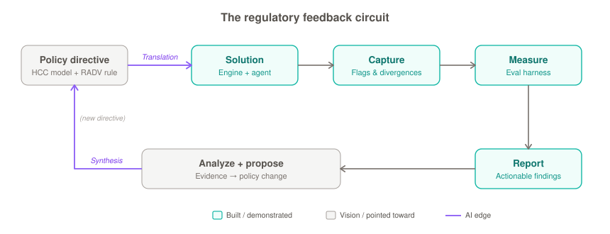

# The Policy Feedback Circuit

> The conceptual frame for `hcc-substantiation-auditor`. The tool is one demonstrated arc of a larger loop. This document states the loop, maps it to the real CMS/RADV artifacts, uses a live legal example to show why the loop matters, and draws the line between what the project *demonstrates* and what it *points toward* — so the vision is compelling without overclaiming.

## The circuit

A regulatory system is a feedback loop, not a one-way pipe:

  

1. **Policy directive** — the goal and the rules: the CMS-HCC model + the RADV audit rule. *(What payment accuracy means, and that diagnoses must be supported in the record.)*
2. **Solution** — the policy operationalized as something executable: this project's deterministic engine (the rules as code) + the agent (the documentation judgment).
3. **Capture** — real-world signal the running solution produces: which codes flag, which documentation patterns fail, where the agent and the engine diverge.
4. **Measure** — quantify that signal: the eval harness (over-coding rate, substantiation accuracy, failure-mode categories).
5. **Report** — structured findings a decision-maker can act on.
6. **Analyze + propose** — aggregate findings into evidence about where the policy itself is ambiguous, miscalibrated, or producing perverse outcomes, and propose changes traceable to that evidence.
7. **Loop** — the proposal re-enters as a candidate directive; the cycle reruns.

## The real insight: AI lives on the *edges*, not in a box

The two hardest transitions in any regulatory loop are the ones between human language and measurable action:

- **Policy → Solution is a translation problem** — natural-language regulation becomes executable logic. Today this is slow, manual, and lossy (armies of analysts interpreting rules into software).
- **Analyze → Policy is a synthesis problem** — measured real-world outcomes become a proposed rule change. Today this is even slower and, as the example below shows, legally fragile.

Those two edges are where institutions are weakest and where AI's value is highest: **AI as the traceable connective tissue of the regulatory loop**, where every policy change carries a verifiable chain back to the evidence that motivated it. That is a sharper thesis than "AI helps with healthcare data."

## Why the loop matters: a live example (Humana v. Becerra)

The RADV program *is* this circuit running in the real world — and recently breaking at the synthesis edge:

- CMS ran a 2018 study (capture/measure), issued a 2018 proposed rule, and finalized the **2023 RADV Final Rule** (analyze → propose → new directive).
- A core decision — eliminating the "fee-for-service adjuster" — was challenged. On **September 25, 2025**, the Northern District of Texas (*Humana v. Becerra*) **vacated the 2023 rule on procedural grounds**, finding CMS's justification was not a "logical outgrowth" of its proposed reasoning and violated the Administrative Procedure Act.

The court didn't rule on whether the policy was substantively right — it ruled that **the chain from evidence to policy change wasn't rigorous/traceable enough**. That is exactly the synthesis edge failing. The thesis of this project's framing: an AI-mediated loop makes that edge *auditable by construction* — proposals carry their evidentiary chain — which is precisely the property whose absence sank the 2023 rule.

## What this project demonstrates vs. what it points toward

**Honesty discipline — state this plainly, it makes the vision credible rather than grandiose:**

- **Demonstrated (built, shown, measured):** the **Solution → Capture → Measure → Report** arc — stages 2–5. A working executable solution, real captured signal on synthetic data, a measurement harness, and reported findings. This is concrete and in the repo.
- **Pointed toward (articulated, not built):** the **Analyze → Propose → Policy** return path — stages 6–7, and the full closed loop. This is the vision the demonstrated arc *implies*, not a system that exists.

Claiming the demonstrated arc precisely, and presenting the full circuit as the direction it opens, is stronger than claiming a self-revising policy system — which no one would believe and which would invite exactly the skepticism the *Humana* court applied to CMS.

## The governance caveat (name it before anyone else does)

The analyze→propose edge has a real hazard: an AI proposing policy changes from data its own solution captured is a closed loop that can drift, entrench its own errors, or optimize the measure instead of the goal (Goodhart's law). The credible version of this vision keeps the AI making the loop **auditable, not autonomous** — proposals are evidence-traceable *inputs* to human and regulatory decision-making, never self-enacting. Speed on the synthesis edge raises the stakes on grounding and oversight; the design answer is traceability and a human in the loop, not automation of the rule-making itself.

## Why the whole-loop view matters

Most engineering effort builds a model or a pipeline (one box). The harder, rarer
capability is seeing the *whole loop* — translating a domain's rules into executable
logic, instrumenting the real-world signal, measuring it rigorously, and closing the
evidence→decision path — and knowing where AI belongs (the edges) and where it must
not (autonomous rule-making). That systems-level, domain-grounded, governance-aware
view is the point of this project.
