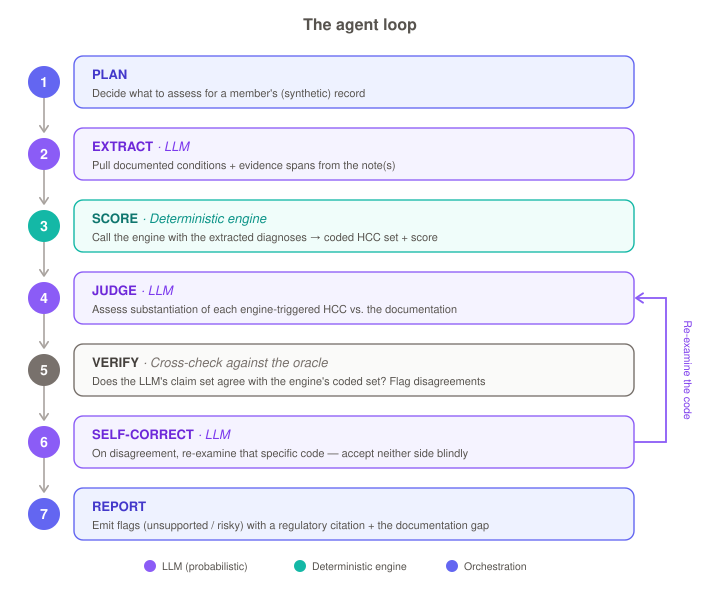

# Walkthrough — one record through the loop

A single record traced end-to-end, using **real output** from the committed audit
run (not invented). To make the point sharp, it follows two patients who carry the
**same coded diagnosis** — Type 2 diabetes with diabetic CKD (`E11.22` → **HCC 37**)
— but whose **notes document it very differently**. The deterministic engine scores
them identically; the auditor's job is the *documentation* judgment that tells them
apart.

<p align="center">
  
</p>

---

## Record A — the over-code (note does *not* support the code)

**The note** (`inj-diabetes-unsupported`):

```
# Chief Complaint
- Ankle sprain.
# History of Present Illness
Patient twisted the right ankle stepping off a curb.
# Assessment and Plan
1. Right ankle sprain. RICE, ibuprofen PRN, follow up if no improvement in two weeks.
```

**1 · PLAN** — assess the member's record for substantiation of its coded HCCs.

**2 · EXTRACT** *(LLM)* — pull documented conditions + verbatim spans. The note only
documents an acute injury:

```json
{ "name": "Right ankle sprain", "icd10": "S82.301",
  "evidence": "Patient twisted the right ankle stepping off a curb.",
  "section": "History of Present Illness" }
```

**3 · SCORE** *(engine)* — the **coded** diagnosis `E11.22` maps to **HCC 37**
(coefficient `0.166`); with the age/sex demographic this yields a risk score of
**0.668**. The engine is authoritative about *what was coded* — it does not care what
the note says.

**4 · JUDGE** *(LLM)* — does the note substantiate HCC 37 under M.E.A.T.? No M.E.A.T.
elements are present for diabetes/CKD — the encounter is about an ankle sprain:

```json
{ "hcc": 37, "final_status": "unsupported", "meat_present": [],
  "specificity_supported": false,
  "documentation_gap": "No mention of Type 2 diabetes mellitus or chronic kidney disease.",
  "citation": "CMS Medicare Managed Care Manual, Ch. 7 (risk adjustment) — M.E.A.T. documentation" }
```

**5 · VERIFY** — cross-check against the oracle + extraction: the engine coded HCC 37,
and **no extracted condition maps to HCC 37** — consistent with an "unsupported" call.
No disagreement.

**6 · SELF-CORRECT** — nothing to re-examine (`initial_status == final_status`).

**7 · REPORT**:

```
[FLAG] HCC 37 (coef 0.166) — E1122 Type 2 diabetes mellitus with diabetic CKD
   status:   unsupported
   gap:      No mention of Type 2 diabetes mellitus or chronic kidney disease.
   citation: CMS Medicare Managed Care Manual, Ch. 7 — M.E.A.T. documentation
```

This is the product's core value: a code that **would be billed** but that **this note
does not support** — surfaced before a RADV audit would, with the regulatory basis and
the specific documentation gap.

---

## Record B — the supported code (same diagnosis, real documentation)

**The note** (`inj-diabetes-supported`) — same coded `E11.22`, but the encounter
actually manages the condition:

```
# Assessment and Plan
1. Type 2 diabetes mellitus with diabetic chronic kidney disease.
   - Monitor:  HbA1c 8.1% today, up from 7.6%. Reviewing home glucose logs.
   - Evaluate: microalbuminuria stable; eGFR 52.
   - Assess:   suboptimal glycemic control with established diabetic CKD.
   - Treat:    continue metformin, increase insulin glargine; referral to nephrology.
```

Same path — **EXTRACT** pulls the diabetes/CKD condition (`E11.22`, from the A&P),
**SCORE** is identical (HCC 37, score **0.668**), but **JUDGE** now finds all four
M.E.A.T. elements:

```json
{ "hcc": 37, "final_status": "supported",
  "meat_present": ["Monitoring","Evaluation","Assessment","Treatment"],
  "specificity_supported": true, "documentation_gap": "" }
```

**REPORT:** HCC 37 — *supported* (cleared). Verify finds the extracted diabetes
condition maps to HCC 37, consistent with "supported"; no self-correction.

---

## The point

|  | Record A (over-code) | Record B (supported) |
|---|---|---|
| Coded diagnosis | `E11.22` → HCC 37 | `E11.22` → HCC 37 |
| **Engine risk score** | **0.668** | **0.668** |
| Documentation | ankle-sprain visit | full M.E.A.T. for diabetic CKD |
| **Auditor verdict** | **FLAG — unsupported** | supported (cleared) |

The **engine score is identical** — the code is coded either way. Everything that
distinguishes the two is the **documentation judgment**, grounded against the
deterministic oracle. That separation — *the LLM proposes, the verified engine
disposes* — is the whole design.

See [`RESULTS.md`](../RESULTS.md) for the measured numbers across the full set, and
[`01_ARCHITECTURE.md`](01_ARCHITECTURE.md) for the components.

### Reproduce
```bash
TABLES=data/cms_hcc_v28/python_v28/software/CMS_HCC_v28/data/input/internal
cargo run -p eval --bin inject_errors -- --fhir-out data/integration/injected_fhir \
  --candidates-out /tmp/c.jsonl --gold-out /tmp/g.jsonl
cargo run --example audit_jsonl -- "$TABLES" crosswalks/snomed_to_icd10_v28.csv \
  data/integration/injected_fhir /tmp/audit.jsonl 50   # records A & B are inj-diabetes-*
```
